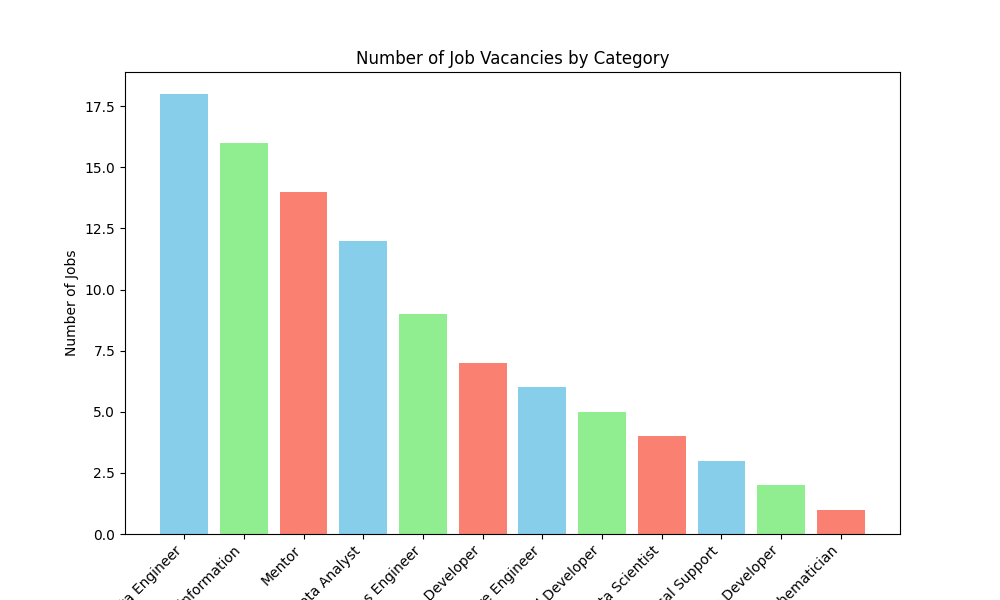
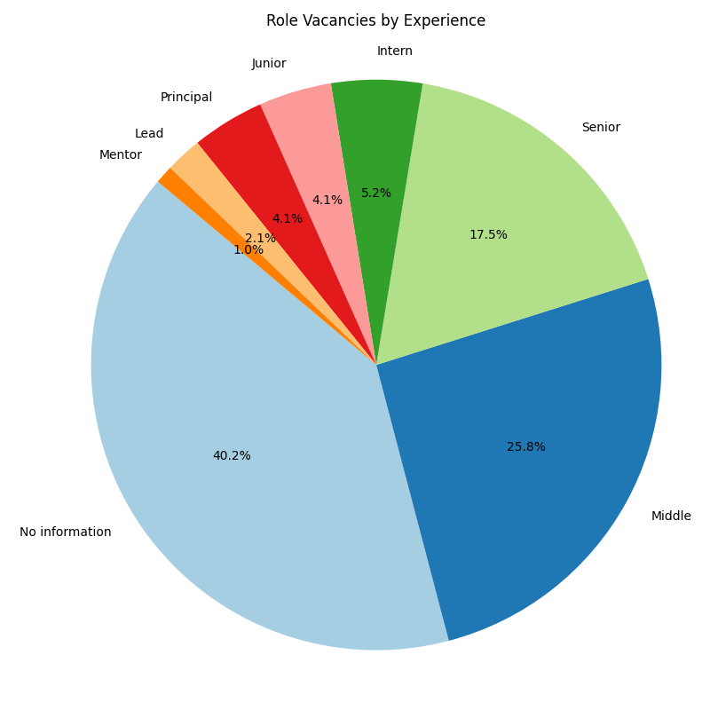
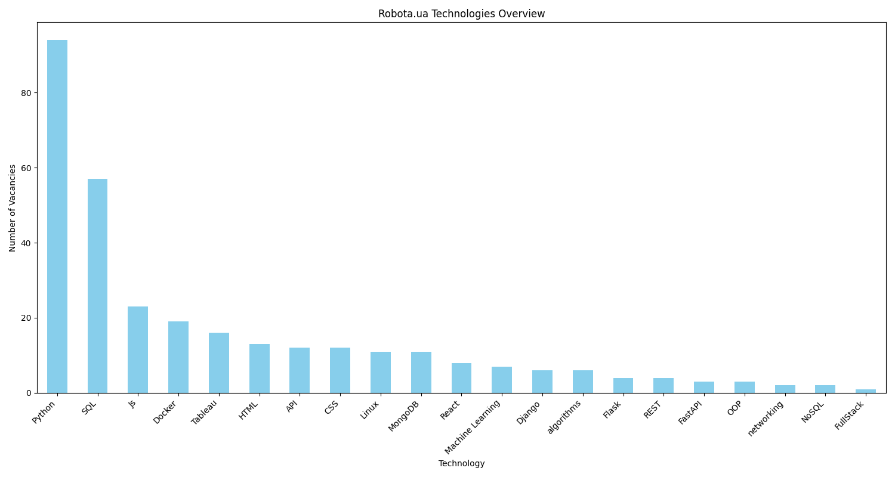
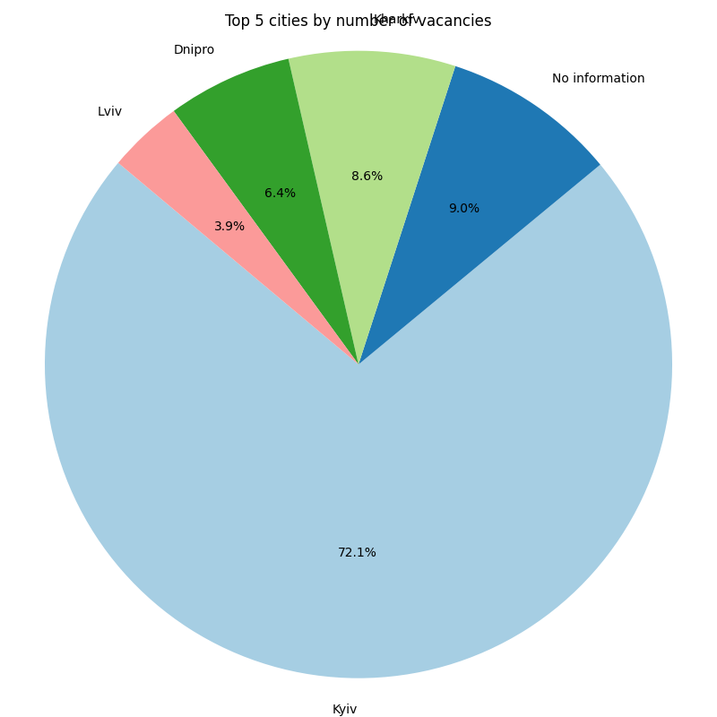

# Python Technologies Statistics

This project combines web scraping and data analysis to help you
understand the most demanded technologies in the current tech job market.
The goal is to gather data on technology mentions from job listings and 
analyze which technologies are most in demand for Python developers.

## Project Overview

The project is split into two parts:
1. **Web Scraping**: Using Scrapy to scrape job listings from
https://robota.ua/ru, extracting relevant technology mentions.
The results are saved to `robota/vacancies.csv`.
2. **Data Analysis**: Using Jupyter Notebook to analyze the scraped 
data and generate insights. Various charts are saved in the `data-analysis/images` directory.

## Getting Started

### Prerequisites

To run this project, you'll need:

- Python 3.x
- Scrapy
- Pandas
- Matplotlib
- Seaborn
- Jupyter Notebook (for analysis)

### Installation

1. Clone this repository:
    ```bash
    git clone https://github.com/Unlie9/py-scrapy-robota-ua.git
    ```

2. Install the required dependencies:
    ```bash
    pip install -r requirements.txt
    ```


### Running the Scraper

To scrape job listings and save the results:

```bash
cd robota
scrapy crawl robota -o vacancies.csv 
```
The output will be saved in robota/vacancies.csv




